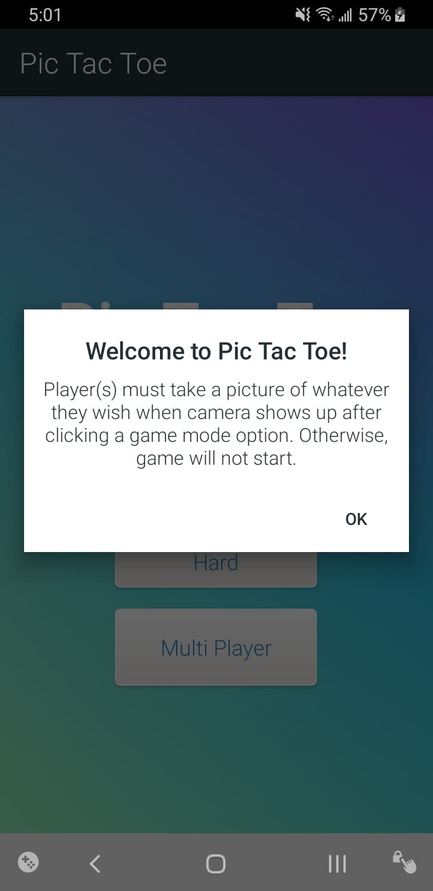
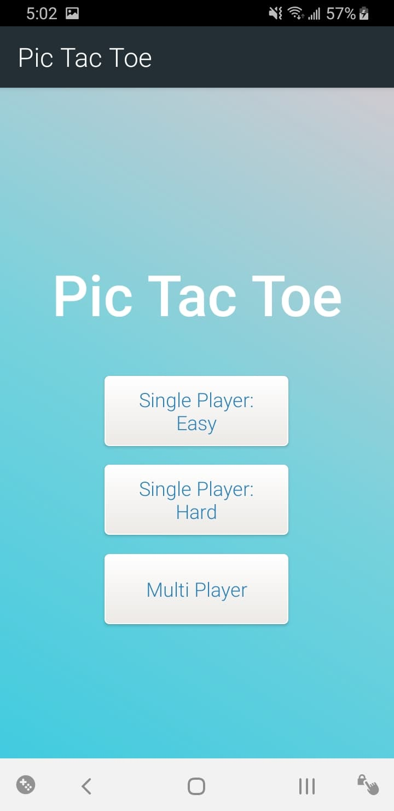
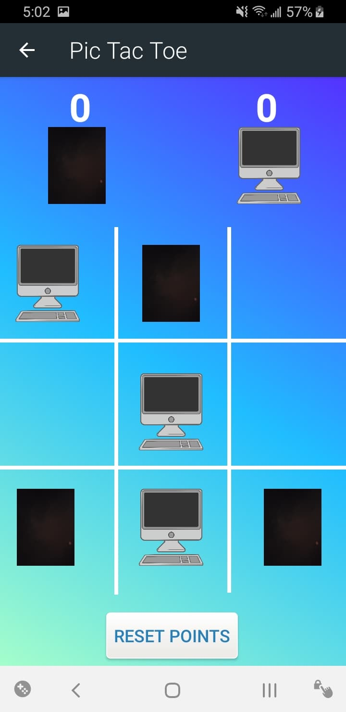
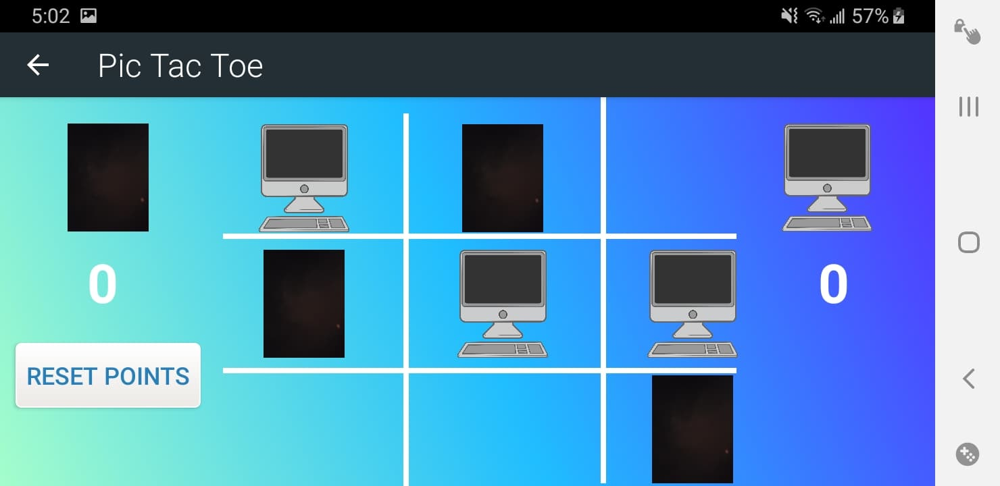

# PicTacToe

Android Tic Tac Toe App appropriately named Pic Tac Toe because instead of the traditional 'X' and 'O', the app uses pictures to identify 
the players.

The game has 3 game mode options that can be selected, which are Single Player: Easy, Single Player: Hard, and Multi Player. User(s) of the app are required to take a picture (of anything) in order to get to the game screen and play the game. 

Game is unbeatable in hard mode, computer always ties or wins the game. This is accomplished using the Minimax Algorithm. Algorithms used in project works for all square boards of size N by N.

App preserves the game data during configuration changes and supports portrait or landscape mode.

# Screenshots

**Dialog Screen**

  

**Main Page Screen**

  

**Game Page Screen (Portrait)**

  

**Game Page Screen (Landscape)**

  

